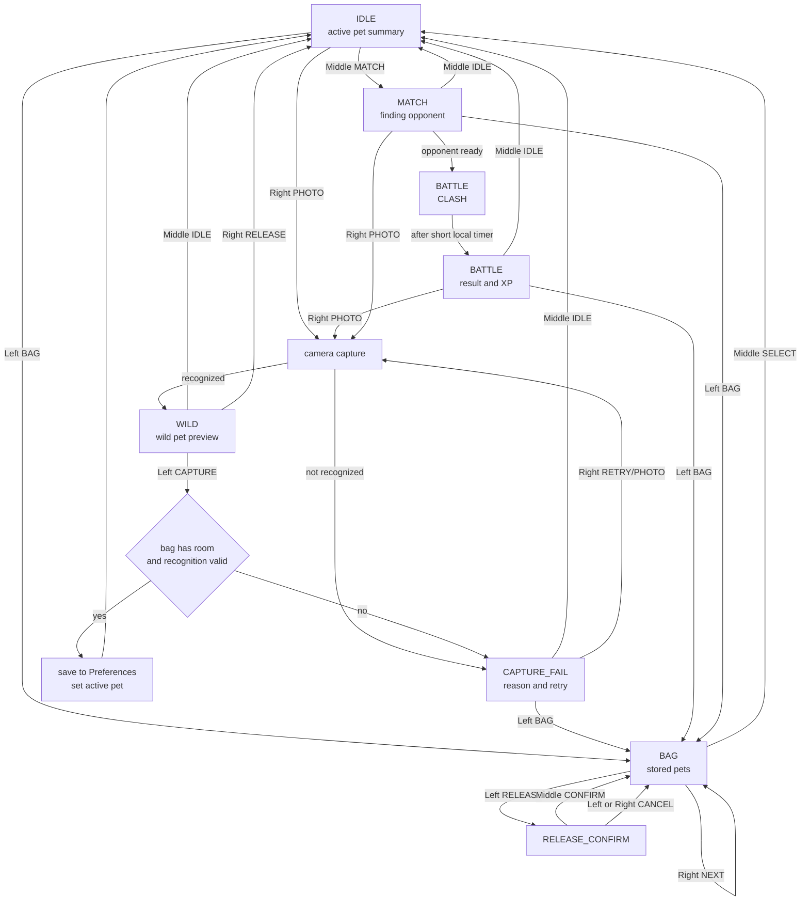

# Player Flow, Backpack Growth, and UI

Scope: `arduino_demos/04_camera_pet_battle/04_camera_pet_battle.ino`.

This document records the device-side player flow. Public shared headers and
`BattlePetPacket` stay unchanged.

Design constraints:

- Do not change the communication protocol.
- Do not change `BattlePetPacket`.
- Plain requirement: 不修改 BattlePetPacket。
- Do not change public enum values.
- Do not restore voice recognition.
- Do not add dependencies.
- Do not remove or bypass `kAudioMuted`.
- If persistent friendship, recent opponent, skill state, or extra battle state
  becomes necessary, submit an interface change suggestion before editing shared
  headers.

## Complete Player Flow



## Screen Information and Buttons

| Screen | Main information | Left | Middle | Right |
| --- | --- | --- | --- | --- |
| IDLE | active pet, level, stage, bag count, next action hint | BAG | MATCH | PHOTO |
| WILD | wild species, element visual, recognition badge, bag count | CAPTURE | IDLE | RELEASE |
| CAPTURE_FAIL | failure reason, presence, confidence, color/debug values | BAG | IDLE | RETRY |
| BAG | slot index, ACTIVE/STORED, species, level, stage, XP, element, mood, wins/battles, win rate | RELEASE | SELECT | NEXT |
| RELEASE_CONFIRM | target pet species and level, irreversible action warning | CANCEL | CONFIRM | CANCEL |
| MATCH | active pet, finding/connected/ready status, friendly waiting hint | BAG | IDLE | PHOTO |
| BATTLE CLASH | local and peer level/element, short battle process state | BAG | IDLE | PHOTO |
| BATTLE RESULT | result, both stats/scores, XP gained, rematch friendship hint | BAG | IDLE | PHOTO |

The player-facing UI should use neutral wording such as `FINDING`, `CONNECTED`,
`READY`, and `CLASH`. Low-level terms such as `HOST`, `CLIENT`, UDP role, packet
layout, and peer IP belong in serial logs or developer docs, not the main player
flow. 用户界面不显示 HOST/CLIENT。

## Button Text and Actions

| Screen | Button | Player text | Action |
| --- | --- | --- | --- |
| IDLE | Left | BAG | Open backpack. |
| IDLE | Middle | MATCH | Enter local opponent search. |
| IDLE | Right | PHOTO | Capture one frame. |
| WILD | Left | CAPTURE | Save recognized wild pet if the bag has room. |
| WILD | Middle | IDLE | Leave wild preview without saving. |
| WILD | Right | RELEASE | Discard wild pet and return to IDLE. |
| CAPTURE_FAIL | Left | BAG | Open backpack to choose an existing pet. |
| CAPTURE_FAIL | Middle | IDLE | Return to main flow. |
| CAPTURE_FAIL | Right | RETRY | Trigger another photo attempt. |
| BAG | Left | RELEASE | Open release confirmation for the shown pet. |
| BAG | Middle | SELECT | Set shown pet as active and return to IDLE. |
| BAG | Right | NEXT | Move to the next stored pet. |
| RELEASE_CONFIRM | Left | CANCEL | Keep pet and return to BAG. |
| RELEASE_CONFIRM | Middle | CONFIRM | Delete selected pet from `Preferences`. |
| RELEASE_CONFIRM | Right | CANCEL | Keep pet and return to BAG. |
| MATCH | Left | BAG | Leave search and open backpack. |
| MATCH | Middle | IDLE | Leave search and return to IDLE. |
| MATCH | Right | PHOTO | Leave search and start capture. |
| BATTLE | Left | BAG | Review pets after result. |
| BATTLE | Middle | IDLE | Return to main flow. |
| BATTLE | Right | PHOTO | Start a new capture. |

## Battle Phase Design

1. Entry: `MATCH` is entered from IDLE with the selected active pet. The page is
   always exit-capable through BAG, IDLE, or PHOTO.
2. Pairing: UDP service keeps broadcasting the active pet packet while the user
   remains in MATCH or BATTLE.
3. Clash: on a new peer packet, the UI shows a short local `CLASH...` phase.
   This gives the player visible battle process without changing the UDP packet.
4. Result: after the clash timer, the local device computes score, win/draw/loss,
   XP, and sound cue. The result page keeps the same escape buttons.
5. Exit: BAG reviews pets, IDLE returns to the main loop, PHOTO starts a new
   capture. Leaving before result cancels the pending local result.

The BATTLE screen should not jump straight from MATCH to the final result. Even
with local deterministic calculation, the player should see a short phase
sequence:

1. `READY`: both pets are visible.
2. `CLASH`: element matchup and power comparison are shown.
3. `RESULT`: win/draw/loss, score, XP, and friendship bonus are shown.

## Battle Settlement Rules

Current settlement should remain local and deterministic:

- Base score uses pet power, agility, spirit, level, and growth state.
- Five-element advantage applies a matchup modifier.
- Seed-based luck breaks ties without network negotiation.
- Win/draw/loss updates battles and wins in the local backpack record.
- XP is awarded after the result page is created.
- Result display must show XP delta so the growth loop is visible.

## Growth and Reward Rules

Current implemented rules:

| Source | Reward | Persistence |
| --- | --- | --- |
| Capture success | 12 XP on the new pet | saved in `BackpackStorage` |
| Waiting growth | 3 XP per 30 seconds, capped to 10 intervals per check | saved in `BackpackStorage` |
| Battle win | 35 XP before bonuses | saved in `BackpackStorage` |
| Battle draw | 16 XP before bonuses | saved in `BackpackStorage` |
| Battle loss | 8 XP before bonuses | saved in `BackpackStorage` |
| Rematch friendship | +5, +10, then +15 XP for repeated battles with the same recent peer | local RAM only |

Level and stage remain bounded: level caps at 30, stage is derived from level
thresholds 1/5/12. Single battle XP is capped at 80 after rematch bonuses.

Recommended growth UX:

- IDLE shows active pet level/stage and backpack capacity.
- BAG shows XP progress, battle count, wins, and win rate.
- BATTLE RESULT shows XP gained and whether the pet leveled up.
- CAPTURE success gives immediate starter XP to make a new pet feel useful.
- Waiting growth remains passive and bounded so it does not dominate battle
  rewards.

## Sound Trigger Points

All sound cues must respect `kAudioMuted`.

| Trigger | Cue intent |
| --- | --- |
| Startup complete | Short startup melody. |
| IDLE loop | Quiet idle feedback or silence. |
| PHOTO capture starts | Camera/capture cue. |
| WILD generated | Element or pet cue. |
| CAPTURE_FAIL | Short failure cue. |
| CAPTURE success | Success cue. |
| BAG open or NEXT | Soft navigation cue. |
| RELEASE_CONFIRM open | Warning cue. |
| RELEASE confirmed | Low discard cue. |
| MATCH entered | Searching cue. |
| Opponent ready | Ready cue. |
| BATTLE CLASH | Clash cue. |
| Battle win | Win cue. |
| Battle draw | Neutral cue. |
| Battle loss | Loss cue. |
| Level up | Growth cue. |

No voice recognition or voice command cue is part of the current design.

## Local Friendship Mechanism

The current safe design keeps friendship local and volatile:

- Track the most recent peer device ID in RAM.
- Count repeated battles against the same recent peer during the current boot.
- Apply rematch XP bonus: +5, +10, then +15 XP.
- Show a short friendship hint on BATTLE RESULT.
- Do not persist friendship in `SavedPet` yet.
- Do not add friendship fields to `BattlePetPacket`.

This satisfies the local friendship loop without changing storage or wire
compatibility. Persistent friendship should be treated as a future interface
change.

## Interface Change Suggestions

No public interface change is required for the current implementation. The
friendship mechanism is intentionally local and volatile.

If friendship must survive reboot, submit this to the architecture module before
editing shared headers:

```text
接口变更建议：
- 需要修改的头文件：pet_model.h
- 当前接口：SavedPet 只保存宠物基因、等级、阶段、XP、战斗次数、胜场、捕捉时间、成长时间。
- 建议改动：新增 lastFriendPeerId、lastFriendBattleSec、friendRematchStreak 等持久化友情字段。
- 改动原因：让再战奖励、最近对手和友情提示在重启后仍可延续。
- 对存档/通信/编译的影响：会改变 Preferences 中 BackpackStorage/SavedPet 的存档布局，需要迁移旧存档；不影响 UDP 包，除非后续跨设备同步友情。
- 是否需要版本号升级：需要升级 kBagVersion。
- 兼容方案：读取旧版本时给新增字段填 0；保存时写入新版本；无法迁移时保留旧宠物核心字段。
```

If friendship needs to work across devices, do not extend `BattlePetPacket`
locally. Propose a versioned protocol update in `battle_protocol.h` through the
system architecture module.

```text
接口变更建议：
- 需要修改的头文件：battle_protocol.h
- 当前接口：BattlePetPacket 只传输对战所需宠物基因、设备 ID、序号和战斗属性。
- 建议改动：不要直接修改 BattlePetPacket；如确实需要跨设备友情同步，新增独立版本化管理包或提出 BattlePetPacket v2。
- 改动原因：友情、技能或战斗阶段同步不应破坏当前 UDP 对战包兼容性。
- 对存档/通信/编译的影响：新增包会增加通信解析分支；修改 BattlePetPacket 会破坏现有收发校验和双机兼容。
- 是否需要版本号升级：新增管理包需要独立 version；修改 BattlePetPacket 则必须升级 kBattleVersion。
- 兼容方案：保留 v1 BattlePetPacket 收发；新能力通过单独包协商，旧设备忽略未知包。
```
