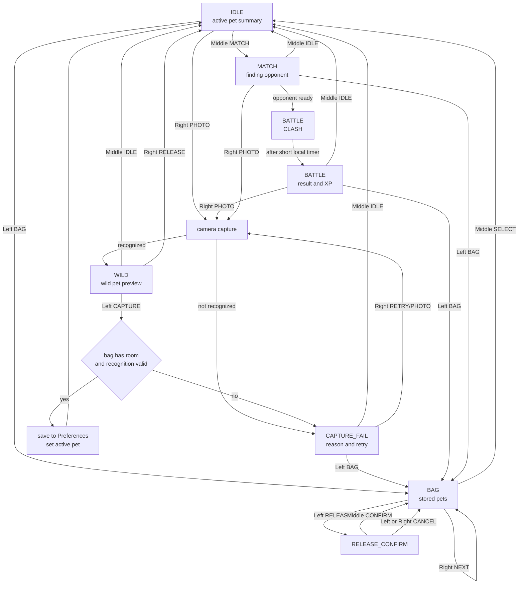

# Player Flow, Backpack Growth, and UI

Scope: `arduino_demos/04_camera_pet_battle/04_camera_pet_battle.ino`.

This document records the device-side player flow. Public shared headers and
`BattlePetPacket` stay unchanged.

Design constraints:

- Do not change the communication protocol.
- Do not change `BattlePetPacket`.
- Plain requirement: 不修改 BattlePetPacket。
- Do not change public enum values.
- Do not restore voice recognition.
- Do not add dependencies.
- Do not remove or bypass `kAudioMuted`.
- If persistent friendship, recent opponent, skill state, or extra battle state
  becomes necessary, submit an interface change suggestion before editing shared
  headers.

## Complete Player Flow



## Screen Information and Buttons

| Screen | Player title / main information | Left | Middle | Right |
| --- | --- | --- | --- | --- |
| IDLE | 休闲状态：first-capture card when no pet; otherwise active pet avatar, level, stage, XP, bag count, win rate, next growth countdown/progress, and recent opponent/friendship/rematch hint when available | 背包 | 匹配 | 拍照 |
| WILD | 野外遭遇：wild species, element visual, recognition badge, bag count, 6-slot capacity bar, full-bag warning; button labels are also mirrored through status JSON | 捕捉 | 休闲 | 放走 |
| CAPTURE_SUCCESS | 捕捉成功：new growth-boosted battle stats, XP progress bar, 6-slot bag bar, active slot number, active-pet confirmation, XP reward, next growth countdown, next evolution/level XP target | 背包 | 对战 | 拍照 |
| CAPTURE_FAIL | 捕捉失败：localized player-facing failure reason, center framing guide or full-bag card, subject/recognition score card for normal failures, and next action hint | 背包 | 休闲 | 重试/拍照 |
| BAG | 伙伴背包：empty first-capture card when empty; otherwise 6-slot capacity bar, cursor, active/stored state, species, level, stage, XP, five-element badge, mood, growth-boosted battle stats, wins/total battles, win rate, next evolution/level XP target, next growth countdown/progress | 放生 | 选择 | 下一只 |
| RELEASE_CONFIRM | 放生确认：target pet avatar, five-element badge, 6-slot bag bar, current target/active slot state, species, level, irreversible action warning, release confirmation summary strip with stage/win-rate/XP rail, and next evolution/level XP target | 取消 | 确认 | 取消 |
| MATCH | 本地匹配：active pet, no-pet preparation card when needed, pairing/connected/ready status, visible middle-exit hint, 寻/连/战 sync meter, friendship card, recent opponent/result with win/draw/loss color cue, rematch XP preview, full-width friendship meter | 背包 | 休闲 | 拍照 |
| BATTLE CLASH | 宠物出场/三回合交锋：local and peer pet names, level/element badges, center VS badge, 力/克/心 round track, per-round impact beams, round advantage | 背包 | 休闲 | 拍照 |
| BATTLE RESULT | 战斗结算/退场整理：result, total score delta meter, 力/克/心 round summary chips, both stats/scores, five-element badges, exit result badge, XP and friendship progress rails, recent opponent, rematch XP preview, friendship meter/hint | 背包 | 休闲 | 拍照 |

The player-facing UI should use neutral wording such as 寻找对手, 配对中,
连接就绪, 准备开战, and 交锋中. Low-level terms such as `HOST`, `CLIENT`, UDP
role, packet layout, and peer IP belong in serial logs or developer docs, not the
main player flow. 用户界面不显示 HOST/CLIENT。

## Button Text and Actions

| Screen | Button | Player text | Action |
| --- | --- | --- | --- |
| IDLE | Left | 背包 | Open backpack. |
| IDLE | Middle | 匹配 | Enter local opponent search. |
| IDLE | Right | 拍照 | Capture one frame. |
| WILD | Left | 捕捉 | Save recognized wild pet if the bag has room. |
| WILD | Middle | 休闲 | Leave wild preview without saving. |
| WILD | Right | 放走 | Discard the wild preview and return to IDLE with a wild-release notice. |
| CAPTURE_FAIL | Left | 背包 | Open backpack to choose an existing pet. |
| CAPTURE_FAIL | Middle | 休闲 | Return to main flow. |
| CAPTURE_FAIL | Right | 重试 | Trigger another photo attempt. |
| BAG | Left | 放生 | Open release confirmation for the shown pet. |
| BAG | Middle | 选择 | Set shown pet as active and return to IDLE. |
| BAG | Right | 下一只 | Move to the next stored pet. |
| RELEASE_CONFIRM | Left | 取消 | Keep pet and return to BAG with a cancellation notice. |
| RELEASE_CONFIRM | Middle | 确认 | Delete selected pet from `Preferences`. |
| RELEASE_CONFIRM | Right | 取消 | Keep pet and return to BAG with a cancellation notice. |
| MATCH | Left | 背包 | Leave search and open backpack. |
| MATCH | Middle | 休闲 | Leave search and return to IDLE. |
| MATCH | Right | 拍照 | Leave search and start capture. |
| BATTLE | Left | 背包 | Review pets after result. |
| BATTLE | Middle | 休闲 | Return to main flow. |
| BATTLE | Right | 拍照 | Start a new capture. |

## Battle Phase Design

1. Entry: `MATCH` is entered from IDLE with the selected active pet. The page is
   always exit-capable through BAG, IDLE, or PHOTO.
   If no active pet is available, MATCH shows a preparation card that directs
   the player to BAG when pets exist or PHOTO when the bag is empty.
2. Pairing: the service keeps broadcasting the active pet packet while the user
   remains in MATCH or BATTLE. The player sees the current pairing step label,
   waiting timer, opponent short ID after sync, and a three-step 寻/连/战 sync
   meter instead of transport details.
3. Clash: on a new peer packet, the UI shows 宠物出场 with both pet names,
   avatars, level/element badges, a center VS badge, and the first round
   advantage immediately. The opponent pet also plays its generated pet sound
   through the normal mute-aware route, then the local three-round clash timer
   begins. The rounds show a 力/克/心 progress track, per-round impact beams
   around the VS badge, current-round App JSON, and a compact ME/RIVAL score
   plate with a center-based red/green advantage meter for each round. This gives the player visible battle process without
   changing the UDP packet.
4. Result: after the clash timer, the local device computes score, win/draw/loss,
   XP, a mirrored local battle ID from the two exchanged packets, and sound cue.
   The result page keeps the same escape buttons.
5. Exit: BAG reviews pets, IDLE returns to the main loop, PHOTO starts a new
   capture. The exit card shows a NEXT line for the available exits or the
   rematch XP opportunity, plus the recent opponent pet name/level when available, friendship state,
   friendship meter, and next rematch XP preview when the rematch window is
   still active. Leaving before result cancels the pending local result.

The BATTLE screen should not jump straight from MATCH to the final result. Even
with local deterministic calculation, the player should see a short phase
sequence:

1. 准备开战: both pets are visible with a center VS badge and first-round advantage.
2. 三回合交锋: power/speed, element matchup, and spirit comparison are shown
   with different center impact visuals for each round.
3. 战斗结算: win/draw/loss, score, mirrored local battle ID, a settlement
   verdict card with score-delta rail, scoring-time 力/速/心 stats, 力/克/心
   round summary chips with 胜/负/平 labels, XP, and friendship bonus are shown.
4. 退场整理: the player sees the compact 力/克/心 round chips again, a NEXT line
   for BAG/IDLE/PHOTO or rematch XP, plus a device-side battle exit choice strip
   inside the footer: L 整理, M 休闲, R 捕捉. The player can then leave to BAG,
   IDLE, or PHOTO without reading a raw status table.

## Battle Settlement Rules

Current settlement should remain local and deterministic:

- Base score uses pet power, agility, spirit, level, and growth state.
- Five-element advantage applies a matchup modifier.
- Seed-based luck breaks ties without network negotiation.
- Win/draw/loss updates battles and wins in the local backpack record.
- XP is awarded after the result page is created.
- Result display must show the total score delta meter, XP delta, XP progress
  rail, and friendship rail when a recent peer exists, so both the battle
  decision and relationship/growth loops are visible.

## Growth and Reward Rules

Current implemented rules:

| Source | Reward | Persistence |
| --- | --- | --- |
| Capture success | 12 XP on the new pet | saved in `BackpackStorage` |
| Waiting growth | 3 XP per 30 seconds, capped to 10 intervals per check | saved in `BackpackStorage` |
| Battle win | 35 XP before bonuses | saved in `BackpackStorage` |
| Battle draw | 16 XP before bonuses | saved in `BackpackStorage` |
| Battle loss | 8 XP before bonuses | saved in `BackpackStorage` |
| Rematch friendship | +5, +10, then +15 XP for repeated battles with the same recent peer | saved in independent `wuxingfr` Preferences namespace |

Level and stage remain bounded: level caps at 30, stage is derived from level
thresholds 1/5/12. Single battle XP is capped at 80 after rematch bonuses.

Local friendship is bounded too: new peers are added automatically after battle,
friendship score caps at 100, score 60 becomes 好友, and score 100 becomes 密友.

Recommended growth UX:

- IDLE shows a first-capture card with 0/6 capacity and framing guide when the
  bag is empty; otherwise it shows active pet avatar, level/stage, XP progress,
  backpack capacity, win rate, next waiting-growth countdown, and a thin
  waiting-growth progress meter.
- IDLE also reuses the active-pet card for recent opponent, last-result or
  rematch bonus, and friendship score when a recent peer exists.
- WILD shows the backpack capacity bar and warns before capture when the bag is
  already full. It also shows a device wild capture quality panel with subject
  and recognition rails before the player presses CAPTURE.
- CAPTURE_FAIL shows a full-bag card with 6-slot capacity and a release-next
  hint when capture fails because the bag is full. Normal recognition failures
  show a two-line quality panel for subject and recognition scores beside the
  framing guide.
- App capture quality card mirrors that guidance with a graphical subject rail,
  recognition rail, ready/retry state, and direct capture or retake action.
- CAPTURE success shows the new pet's growth-boosted battle stats, immediate XP reward, active slot
  number, 6-slot bag bar, next evolution/level XP target, and next
  waiting-growth countdown. It also includes a compact NEXT growth badge with a
  small waiting-growth progress rail.
- RELEASE_CONFIRM keeps the irreversible warning dominant, then adds a compact
  release confirmation summary strip for slot, active/stored state, stage, win
  rate, and XP rail, plus the same NEXT growth badge before the middle button
  can delete the pet.
- BAG shows the 6-slot capacity bar, active slot, cursor slot, XP progress,
  growth-boosted 力/速/心 battle stats, wins/total battles, win rate, next
  evolution/level XP target, next waiting-growth countdown, and a thin
  waiting-growth progress meter on the same quick-read status area. A compact
  NEXT growth badge keeps the next evolution/level target visible above the
  stat panel.
- `/app` current-pet/backpack cards and USB serial `STATUS` mirror the same next
  evolution/level XP target; the App renders it as a separate compact badge
  and uses the same growth-boosted battle stats without adding fields to
  `SavedPet`.
- App pet growth wait rail mirrors the device waiting-growth countdown on
  current-pet and backpack cards with a small progress rail and seconds label.
- App training plan card sits under the current partner on the home page and
  turns growth into three readable sources: capture XP, battle XP, and passive
  waiting growth, with direct PHOTO/BATTLE/BAG actions.
- `/app` home status starts with a larger current-flow banner based on
  `screenLabel`; each screen mode gets a small color strip so IDLE, capture,
  backpack, match, battle, and release confirmation read like game states.
- During MATCH and BATTLE, screenLabel follows battle phase labels such as
  寻找训练师, 羁绊同步, 同步完成, 宠物交锋, 战斗结算, and 退场整理 instead of a fixed
  technical page name.
- The device MATCH title follows pairing stage labels too, so the player sees
  device MATCH title follows pairing stage wording instead of a generic match
  page header.
- On the CoreS3 screen, all page titles use a compact game-state title plate
  with an accent stripe and border so state names stand out without moving the
  existing controls.
- Empty BAG shows a first-capture card with 0/6 capacity, framing guide, and
  clear PHOTO next step.
- App empty BAG first-capture card mirrors that same 0/6 empty-capacity state
  in `/app`, with a direct PHOTO action and a secondary capture-page shortcut.
- App bag overview card sits above the current backpack pet and shows capacity,
  active slot, device cursor slot, and remaining empty slots as a quick-read
  six-slot rail.
- App current-pet empty card replaces the plain no-pet text with a 6-slot
  visual: stored pets point to BAG selection, while an empty bag points to
  PHOTO capture.
- App home action panel turns the home "next step" area into a game-like
  action surface: current flow title, primary next action, BAG/Friends shortcuts,
  recent opponent, latest result, friendship score, and rematch XP cue.
- BATTLE RESULT shows a settlement verdict card with result, total score
  difference, mirrored local battle ID, and score-delta rail, plus 力/克/心 round
  summary chips with 胜/负/平 labels, scoring-time battle stats, XP gained/progress,
  friendship progress, and whether the pet leveled up. `/app` adds an App battle verdict card for result,
  score difference, and battle ID, then mirrors
  the same round verdict labels as three compact chips for bench review.
- App battle phase card sits above the battle tab details and shows the current
  phase, pairing progress, waiting time, and active clash round when available.
- App match readiness card appears before the battle phase card and gathers the
  active partner, recent opponent, latest result, friendship goal, and rematch
  XP cue so MATCH preparation is readable before the boards connect.
- App battle entry card sits between phase and matchup. It names the local
  partner, the synced or waiting opponent, and the entry status before the VS
  avatar card appears.
- Device BATTLE CLASH shows a short 同步局 ID during pet entry so both boards can
  visually confirm they are resolving the same local battle.
- App battle matchup card mirrors the pet-entry moment with current partner,
  opponent partner, avatars, level/element labels, and a center VS badge.
- App battle round track card mirrors the three-round clash as a readable
  力速/五行/气势 track with current-round highlight and score chips.
- App battle reward card groups XP, growth result, rematch XP, next friendship
  gain, and the friendship rail so the App result page reads like a settlement
  screen instead of a raw status table.
- App battle exit card appears after a valid result and highlights the next
  player actions: rematch, return to idle, open the bag, or add the recent
  opponent as a local friend.
- App battle replay history card turns the latest local battle records into
  compact result cards with opponent, skill, round, XP, friendship, and growth
  chips instead of showing them as raw log rows.
- CAPTURE success gives immediate starter XP to make a new pet feel useful.
- Waiting growth remains passive and bounded so it does not dominate battle
  rewards.

## Sound Trigger Points

All sound cues must respect `kAudioMuted`. Built-in synthesized cues are always
available. Optional SD-card `.raw` clips can override them when present, using
short unsigned 8-bit mono PCM at 22050 Hz under the documented `/audio/...`
paths; missing clips or no SD card must fall back to the built-in cue.

| Trigger | Cue intent |
| --- | --- |
| Startup complete | Short startup melody. |
| IDLE loop | Quiet idle feedback or silence. |
| PHOTO capture starts | Camera/capture cue. |
| WILD generated | Element or pet cue. |
| CAPTURE_FAIL | Short failure cue. |
| Full-bag capture fail | Warning cue followed by BAG cue to point the player toward release/select flow. |
| CAPTURE success | Success cue. |
| BAG open or NEXT | Soft navigation cue. |
| RELEASE_CONFIRM open | Warning cue. |
| RELEASE_CONFIRM cancelled | Short cancel cue, then BAG notice. |
| RELEASE confirmed | Low discard cue. |
| MATCH entered | Searching cue. |
| MATCH entered without active pet | Warning cue followed by BAG cue when stored pets exist, or PHOTO cue when the bag is empty. |
| MATCH sync advances to 连 or 战 | One-shot pairing or clash-ready cue. |
| Opponent ready | Ready cue. |
| BATTLE CLASH | Entry cue, opponent pet sound, plus one-shot round-advance cues for 第2回合 and 最终回合. |
| Battle win | Win cue. |
| Battle draw | Neutral cue. |
| Battle loss | Loss cue. |
| Level up | Growth cue. |
| Battle exit | Short exit cue. |
| New friend, rematch bonus, or bond upgrade | Friendship cue. |
| Friendship threshold preview | One-shot friendship cue on MATCH when the next rematch can cross friend or close-friend rank. |

The `/app` settings page includes an App soundboard panel for bench testing the
same scene cues through `/api/v1/action?type=sound&cue=...`; every button still
routes through `play_scene_sound`, so mute behavior and SD fallback stay shared
with normal gameplay. The panel covers all serial SOUND cues so phone-side bench
testing can exercise idle, capture, release, battle, friendship, result, growth,
exit, and cancel sounds without bypassing the shared mute gate.

App event filter count badges appear on the `/app` event page. The category
tabs still open the same latest-20 event list and detail view, but each tab now
shows how many current events match that category before the player filters it.

No voice recognition or voice command cue is part of the current design.

## Local Friendship Mechanism

The current safe design keeps friendship local to the device and persistent
without changing public pet storage or the UDP packet:

- Track the most recent peer device ID in the independent `wuxingfr`
  Preferences namespace.
- Count repeated battles against the same recent peer across reboots on the
  same board.
- Apply rematch XP bonus: +5, +10, then +15 XP.
- Show friend count, recent opponent, friendship score meter, recent result,
  compact 好友/密友 goal badge, next threshold hint, rematch XP preview, and
  stage-colored friendship rails on MATCH, BATTLE RESULT, and EXIT.
- MATCH and BATTLE EXIT also show a compact device-side friendship badge with
  the current bond label and score color, so new friend, 好友, and 密友 states are
  readable at a glance.
- Play a one-shot friendship cue on MATCH when the next rematch can cross the
  friend or close-friend threshold for the current peer and target rank.
- Predict whether the next rematch can cross the 好友 or 密友 threshold, show a
  direct 再战可成好友/密友 reminder, and play the level-up cue on bond upgrade.
- Mirror the recent opponent, 好友/密友 progress, local friend list, next
  friendship gain, and rematch XP reward through `/app` and USB serial `STATUS`
  for bench validation. `/app` renders the same friendship stage as compact
  progress rails on the battle summary, friendship summary, and each local
  friend card.
- App friend empty card gives the first friendship action a visible place:
  when no local friend is recorded, it shows the recent opponent, current
  friendship goal, and direct add-friend/rematch actions.
- App friend goal card keeps the friendship page focused on the current goal:
  current stage/score, recent opponent, next rematch XP, next friendship gain,
  and direct battle/add-friend actions.
- App friend streak card makes repeated battles visible as a three-step chain:
  rematch streak, next XP reward, next friendship gain, and the current close
  friend goal.
- Allow external local friend add through `/app` action `friend` and USB serial
  `ACT friend`; this uses the current visible opponent or the most recent
  opponent, saves the local friend table, and shows a short on-device result
  notice.
- Show explicit notices for new friend, rematch reward, 好友 upgrade, and 密友
  upgrade.
- Do not persist friendship in `SavedPet`; it lives in a separate Preferences
  namespace so `kBagVersion` is unchanged.
- Do not add friendship fields to `BattlePetPacket`.

This satisfies the local friendship loop without changing storage or wire
compatibility. Cross-device friendship sync should be treated as a future
interface change.

## Interface Change Suggestions

No public interface change is required for the current implementation. The
friendship mechanism is local to one board and persisted separately from
`SavedPet`.

If friendship must be stored inside each `SavedPet` record instead of the
separate `wuxingfr` namespace, submit this to the architecture module before
editing shared headers:

```text
接口变更建议：
- 需要修改的头文件：pet_model.h
- 当前接口：SavedPet 只保存宠物基因、等级、阶段、XP、战斗次数、胜场、捕捉时间、成长时间。
- 建议改动：新增 lastFriendPeerId、lastFriendBattleSec、friendRematchStreak 等持久化友情字段。
- 改动原因：让再战奖励、最近对手和友情提示在重启后仍可延续。
- 对存档/通信/编译的影响：会改变 Preferences 中 BackpackStorage/SavedPet 的存档布局，需要迁移旧存档；不影响 UDP 包，除非后续跨设备同步友情。
- 是否需要版本号升级：需要升级 kBagVersion。
- 兼容方案：读取旧版本时给新增字段填 0；保存时写入新版本；无法迁移时保留旧宠物核心字段。
```

If friendship needs to work across devices, do not extend `BattlePetPacket`
locally. Propose a versioned protocol update in `battle_protocol.h` through the
system architecture module.

```text
接口变更建议：
- 需要修改的头文件：battle_protocol.h
- 当前接口：BattlePetPacket 只传输对战所需宠物基因、设备 ID、序号和战斗属性。
- 建议改动：不要直接修改 BattlePetPacket；如确实需要跨设备友情同步，新增独立版本化管理包或提出 BattlePetPacket v2。
- 改动原因：友情、技能或战斗阶段同步不应破坏当前 UDP 对战包兼容性。
- 对存档/通信/编译的影响：新增包会增加通信解析分支；修改 BattlePetPacket 会破坏现有收发校验和双机兼容。
- 是否需要版本号升级：新增管理包需要独立 version；修改 BattlePetPacket 则必须升级 kBattleVersion。
- 兼容方案：保留 v1 BattlePetPacket 收发；新能力通过单独包协商，旧设备忽略未知包。
```
